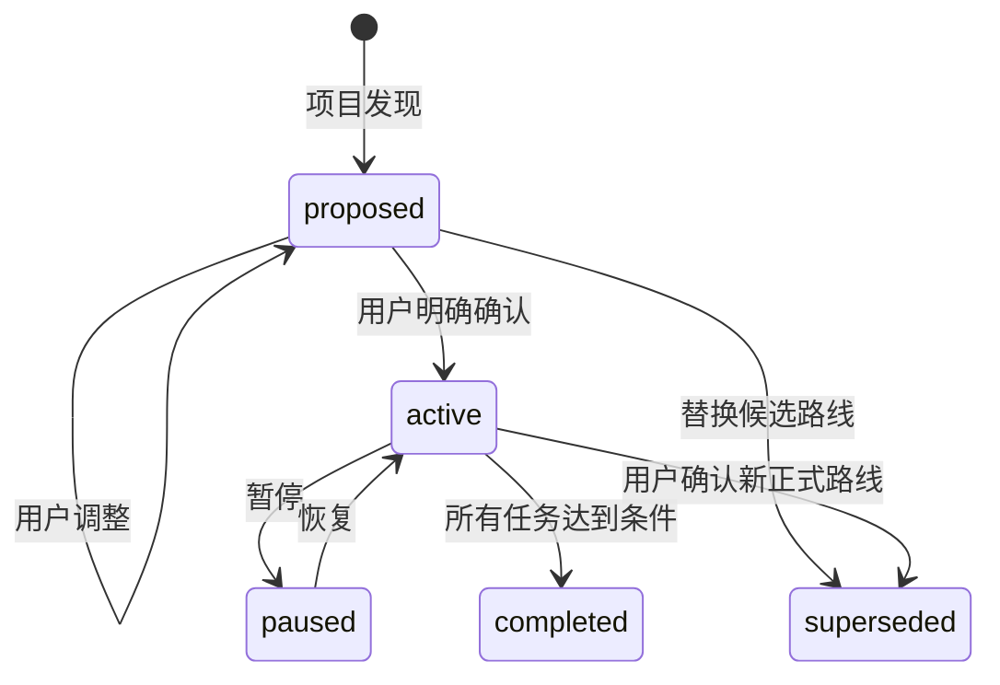

# 状态设计原理

## 日常入口与问答快照

日常交互使用只读 `resume`，不用每次重跑扫描。新增的 `questions/<id>.json` 保存提问当时的源码位置、相关讲解、源任务断点和源项目路径，`<id>.md` 是可读视图，`<id>-answer.md` 是答案。主线后来推进不会改写这份历史语境。

workstream 可以增加 `recent_explanation` 和 `thread: {id, host}`，分别保存相关讲解和已确认的宿主任务绑定；这些都不是掌握证据。新字段可选，既有 v2 项目不需要迁移。`prepare-qa` 只注册必要问答窗口，不改写主线或正在使用的问答断点；详细规则见 [问答衔接](../skill-src/adaptive-engineering-learning/references/question-handoff.md)。

下文描述底层协议；用户日常只需要区分主线与问答，不必维护这些字段。

状态设计的目标不是保存更多文件，而是让多个 Codex 任务窗口可以围绕同一个项目学习，同时不混淆：

```text
项目事实
≠ 课程路线
≠ 学习任务
≠ Codex 窗口
≠ 掌握证据
≠ 稳定知识
```

## 1. 为什么从单一 progress.json 升级

schema v1 的 `progress.json` 适合单用户、单主窗口顺序学习，但在以下场景中容易发生冲突：

- 主线讲解时，另一个窗口回答临时问题。
- 练习窗口和 Review 窗口同时记录同一任务。
- Debug 窗口发现根因，主线还停在旧上下文。
- 两个窗口同时写 `current_task_id`、问题列表或下一步。

即使每次都原子替换整个 JSON，也只能避免半写文件，不能避免“后写覆盖前写”的语义丢失。

schema v2 将状态按写入所有权拆开：

```text
tasks/<id>.json       每个学习目标一个文件
workstreams/<id>.json 每个 Codex 窗口一个文件
inbox/<id>.json       每条跨窗口贡献一个文件
shared.json           同步后接受的共享上下文
workspace.json        轻量注册表和主线指针
```

## 2. 状态分层

| 文件/目录 | 权威职责 | 明确不负责 |
| --- | --- | --- |
| `config.json` | 偏好、权限、确认门、协作策略 | 任务进度 |
| `project.json` | 最近验证的项目事实 | 课程安排 |
| `plan.json` | 路线、阶段顺序和生命周期 | Codex 窗口位置 |
| `workspace.json` | task/workstream 注册和主线指针 | 详细任务内容 |
| `tasks/*.json` | 单个学习任务的状态、证据、问题 | 窗口恢复位置 |
| `workstreams/*.json` | 单个 Codex 窗口的焦点和续接状态 | 课程顺序 |
| `inbox/*.json` | 待同步的跨窗口贡献 | 已接受的共享知识 |
| `shared.json` | 已同步知识、问题、阻塞、证据候选 | 稳定笔记正文 |
| `dashboard.md` | 人类可读总览 | 权威状态 |
| `handoffs/*.md` | 人类可读窗口续接卡 | 权威状态 |
| `notes/` | 稳定、可复习知识 | 当前任务状态 |
| `sessions/` | 精简历史记录 | 完整聊天 |

## 3. 课程确认门

候选计划与正式课程保持分离：



`proposed` 阶段允许：

```text
config.json
project.json
project-map.md
plan.json
```

禁止创建：

```text
workspace.json
tasks/
workstreams/
shared.json
正式进度或掌握记录
```

激活必须保存用户确认摘要。多窗口能力不能绕过这道门。

## 4. Task 与 Workstream 的正交关系

### Task

Task 表示要学习或完成的目标：

- `chapter`
- `qa`
- `exercise`
- `review`
- `debug`
- `implementation`

它包含 objective、source scope、completion criteria、status、evidence、questions、blockers 和 next step。

### Workstream

Workstream 表示一个 Codex 任务窗口：

- `mainline`
- `qa`
- `exercise`
- `review`
- `debug`
- `pair`
- `implementation`

它包含 attached task、focus、resume point、code locations、local questions/blockers 和 next step。

正交设计解决了几个常见误判：

- Q&A 窗口回答完问题，不代表章节 mastered。
- Review 窗口结束，不代表学习者完成修正。
- Implementation 窗口代码通过测试，不代表学习者理解实现。
- 多个窗口可以引用同一个任务，但保留各自恢复位置。

## 5. 主线权威与侧线边界

`mainline` 负责：

- 当前课程位置
- 主任务切换
- 掌握判断
- 计划级决策

侧线负责：

- 完成限定角色的工作
- 保存自己的 checkpoint
- 通过 inbox 发布对其他窗口有价值的信息

关键限制：

- Q&A 不能直接更新 task status。
- 非主线窗口只能直接更新 attached task。
- 计划变更只能进入共享待确认队列。
- 实现任务和实现 workstream 必须保存明确授权。

## 6. 跨窗口信息为什么先进入 Inbox

让侧线直接修改 `shared.json` 或主线 task 会造成写入竞争和权限模糊。

使用 append-only inbox：

```text
侧线产生结论
→ publish 创建唯一 contribution 文件
→ sync 在锁内重新读取权威状态
→ 按类型验证和合并
→ contribution 标记 accepted 或 queued
```

贡献类型：

- `question`
- `answer`
- `finding`
- `evidence`
- `blocker`
- `plan_change`

合并规则是确定性的：

| 类型 | 处理 |
| --- | --- |
| answer/finding | 进入共享知识；verified 时必须带源码 |
| question | 进入共享问题和相关 task |
| blocker | 进入共享阻塞和相关 task |
| learner evidence | 加入相关 task，但不改 status |
| Codex-only evidence | 只进入候选队列 |
| plan change | 永远 queued，等待确认 |

## 7. 掌握证据

`mastered` 默认需要：

1. 至少一条证据
2. 至少一条 `learner_originated == true`

有效证据包括学习者：

- 用自己的话解释完整调用链
- 准确定位相关源码
- 预测关键数据或控制流变化
- 完成局部实现/测试并解释决策
- 发现常见失败
- 解释关键 trade-off

不构成学习者证据：

- Codex 完成长篇讲解
- Codex 编写代码
- 测试仅因 Codex 修改而通过
- 窗口或 Session 正常结束

侧线可以发布学习者证据，`sync` 把它加入 task，但最终 mastery 仍需主线或任务所属学习流程明确判断。

## 8. 锁与原子写

每个变更命令：

1. 通过 exclusive create 获取 `.learning/.state.lock`
2. 获取锁后重新读取状态
3. 只修改目标文件/字段
4. 写临时文件
5. 使用 `os.replace` 原子替换
6. 释放锁

这能避免：

- 同时写出损坏 JSON
- sync 与 checkpoint 交错
- 侧线发布时 workspace 被半更新

它不能自动解决：

- 用户手工编辑后的复杂三方合并
- 外部工具绕过锁直接写文件
- 进程崩溃后未确认的陈旧锁

锁超时时脚本不会自动删除锁，因为另一个窗口可能仍在写。应检查 PID/operation，再做恢复。

## 9. Markdown 固化策略

用户需要在不同任务中快速理解项目状态，因此生成：

```text
dashboard.md       项目级总览
handoffs/<id>.md   窗口级续接卡
sessions/<id>/     窗口历史
```

Dashboard/Handoff 的优点：

- 人类和 Codex 都可快速浏览
- 可被 Git/编辑器/Obsidian 查看
- 不需要解析所有 JSON

它们是派生视图，避免重新制造“两份权威状态”。状态变化后由脚本重新生成。

稳定知识仍写入 `notes/`。它们是人工可维护正文，不由 dashboard 生成器覆盖。

## 10. 计划版本一致性

`workspace.plan_version` 必须等于 `plan.plan_version`。如果不一致：

```text
路线已经变化
≠ 执行状态已正确迁移
```

系统必须停止任务更新并要求检查，不能猜测如何自动合并。侧线提出的计划变更保持排队，可减少这种隐式失配。

## 11. v1 → v2 迁移

迁移步骤：

1. 完整复制 `.learning/` 到 `.learning-archives/migration-v1-*`
2. 升级 config/project/plan/notes index
3. 把旧 `progress.tasks` 拆成 `tasks/*.json`
4. 用旧 current task/code locations 创建 `mainline`
5. 创建 workspace/shared/dashboard/handoff
6. 把旧进度复制到 `legacy/progress-v1.json`
7. 移除已被替代的根 `progress.json`
8. 运行 `doctor`

迁移保留旧 task status 和证据，不推断新的 mastered 状态。

## 12. 设计边界

这是面向单个项目文件系统的轻量协作状态系统，不是在线 LMS 或分布式数据库。目前不解决：

- 跨设备实时同步
- 数据库级多文件事务
- 任意分叉路线自动合并
- 外部编辑器绕过协议的冲突
- Codex 任务 ID 的自动稳定发现

设计优先级是：

```text
可理解
→ 可恢复
→ 写入所有权明确
→ 冲突面小
→ 不引入目标项目依赖
```

## 相关实现

- Skill 状态规范：`skill-src/adaptive-engineering-learning/references/state-model.md`
- 多窗口协议：`skill-src/adaptive-engineering-learning/references/multi-workstream-coordination.md`
- 状态工具：`skill-src/adaptive-engineering-learning/scripts/learning_state.py`
- 行为测试：`skill-src/adaptive-engineering-learning/scripts/test_learning_state.py`

[返回 README](../README.md) · [查看项目介绍](../INTRODUCTION.md)
