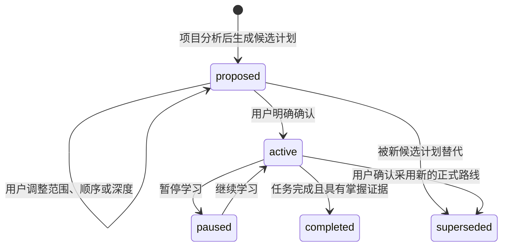

# 状态设计原理

这套状态设计的核心不是“保存更多文件”，而是把容易混淆的四件事明确分开：

```text
项目是什么
≠ 准备学习什么
≠ 当前学习到哪里
≠ 已经真正掌握什么
```

如果这些信息都依赖对话上下文或写在同一个文档里，系统很容易把自动生成的计划当成正式课程、把阅读过一次当成掌握，或者在重新扫描项目后覆盖已有进度。

## 1. 状态分层

| 文件或目录 | 负责管理 | 明确不负责 |
| --- | --- | --- |
| `config.json` | 学习模式、讲解深度、权限、笔记位置和关注方向 | 当前进度 |
| `project.json` | 最近一次扫描确认的项目事实 | 课程安排 |
| `project-map.md` | 面向学习者的项目概览和学习价值判断 | 机器状态 |
| `plan.json` | 学习目标、阶段顺序、计划版本和生命周期 | 当前执行位置 |
| `progress.json` | 当前任务、代码位置、证据、问题、阻塞和下一步 | 稳定知识正文 |
| `notes-index.json` | 已有笔记的位置、类型和验证状态 | 笔记正文 |
| `notes/` | 已验证、具有复习价值的稳定知识 | 任务状态 |
| `sessions/` | 单次学习的精简过程记录 | 完整聊天内容 |

可以把三类核心状态理解为：

```text
plan.json     = 学习地图
progress.json = 在地图上的当前位置
notes/        = 学习过程中真正沉淀下来的知识
```

调整地图不会自动改变当前位置，走到某个位置也不代表已经掌握沿途全部知识。

## 2. 单一状态来源

同一类状态只维护一份权威来源：

- 计划结构与顺序只写在 `plan.json`。
- 任务执行状态只写在 `progress.json`。
- 项目扫描事实只写在 `project.json`。
- Markdown 笔记只保存知识，不重复维护任务状态。

这样可以避免 `tasks.md`、`progress.md` 和 JSON 同时记录状态后逐渐不一致。

## 3. 计划生命周期



- `proposed`：Codex 提出的建议，还不是正式课程。
- `active`：用户已经明确确认，可以创建任务并推进学习。
- `paused`：保留路线和当前位置，暂时停止推进。
- `completed`：正式路线已经达到完成条件。
- `superseded`：计划被新版本替代，但历史仍然保留。

## 4. 确认门

确认门用来保证 Codex 可以主动分析和建议，但不能替用户决定完整课程路线。

在 `proposed` 阶段允许保存：

```text
config.json
project.json
project-map.md
plan.json
```

此时禁止创建：

```text
progress.json
大量正式任务
掌握记录
正式课程进度
```

激活计划必须带有非空的用户确认记录。例如：

```text
计划可以，但把数据库放到后面，先学习请求调用链。
```

只有这时状态脚本才会把计划改为 `active`、记录确认摘要、创建 `progress.json`，并将第一个任务设置为 `learning`。用户没有反对、查看了候选计划或者表示“看起来不错”，都不能被自动推断为确认。

## 5. 计划版本一致性

每次修改候选计划都会递增 `plan_version`，并记录必要的调整原因：

```json
{
  "plan_version": 2,
  "manual_adjustments": [],
  "change_log": []
}
```

正式进度同时记录自己对应的计划版本：

```json
{
  "plan_version": 2
}
```

更新任务前必须满足：

```text
progress.plan_version == plan.plan_version
```

如果二者不一致，说明课程路线已经变化，但执行状态还停留在旧版本。系统应停止更新并要求检查，而不是猜测如何合并。

## 6. 任务状态描述学习行为

任务状态不是简单的“未完成 / 已完成”，而是描述学习者当前正在进行的行为：

```text
not_started
learning
questioning
practicing
reviewing
blocked
needs_review
mastered
paused
skipped
```

例如：

- 阅读并跟踪源码时使用 `learning`。
- 正在澄清框架或设计问题时使用 `questioning`。
- 完成项目内练习时使用 `practicing`。
- 已完成实现、等待检查时使用 `needs_review`。
- 只有能够提供掌握证据时才使用 `mastered`。

## 7. 掌握必须有证据

讲解完成、阅读过代码或由 Codex 代写了实现，都不能证明学习者已经掌握。

有效证据可以包括：

- 学习者能用自己的话解释完整调用链。
- 能准确定位相关源码。
- 能预测关键数据如何变化。
- 能完成局部修改或测试。
- 能发现常见错误。
- 能解释一个重要的工程 trade-off。

示例：

```json
{
  "status": "mastered",
  "evidence": [
    {
      "kind": "learner_explanation",
      "detail": "学习者独立解释了路由、中间件、Handler、Service 和响应返回流程"
    }
  ]
}
```

## 8. 重新扫描只更新项目事实

项目切换分支或发生较大变化后，重新扫描首先更新 `project.json`，而不是直接改写正式计划：

```text
仓库发生变化
→ 更新项目事实
→ 输出差异报告
→ 标记受影响的学习阶段
→ 提出计划调整建议
→ 等待用户确认
```

这能防止一次分支切换导致课程路线和既有学习进度被自动重置。

## 9. 为什么状态使用 JSON、知识使用 Markdown

状态文件使用 JSON，因为：

- Python 标准库可以直接解析，不需要安装额外依赖。
- Windows、macOS 和 Linux 行为一致。
- 容易校验字段、枚举值和状态转换。
- 可以通过临时文件与 `os.replace` 进行原子更新。
- Git diff 相对清晰。

知识笔记使用 Markdown，因为：

- 普通编辑器和 Obsidian 都可以直接使用。
- 适合人工补充和长期复习。
- 可以使用标题、链接和双向链接组织知识。

其取舍是 JSON 不支持注释，手工编辑体验不如 YAML，因此配置含义需要由 README 和使用说明解释。

## 10. 当前设计边界

这是一个面向单用户、单主 Agent 的轻量状态系统，不是完整的在线学习管理平台。目前没有专门解决：

- 多个 Agent 同时写入状态时的锁与冲突。
- 跨设备实时同步。
- 多个状态文件之间的数据库级事务。
- 两条分叉学习路线的自动合并。
- 用户手工修改状态后的复杂三方合并。

它优先选择少量文件、明确职责、可恢复和可审查，而不是引入数据库或沉重的工作流引擎。

## 相关实现

- 状态模型说明：`.agents/skills/adaptive-engineering-learning/references/state-model.md`
- 状态转换脚本：`.agents/skills/adaptive-engineering-learning/scripts/learning_state.py`
- 行为测试：`.agents/skills/adaptive-engineering-learning/scripts/test_learning_state.py`

[返回 README](../README.md) · [查看项目介绍](../INTRODUCTION.md)
