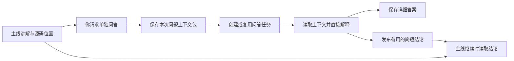

# 中文使用说明书

适用版本：包含 `resume`、`prepare-qa`、`bind-thread` 的精简版；学习状态格式仍为 schema v2。

日常只需要两个空间：**主线用于连续学习，问答任务用于展开疑问**。模式判断、上下文交接和文件保存由代理处理，不需要你填写状态表。

## 1. 先理解它怎样工作

这套 Skill 由三部分配合：

| 部分 | 负责什么 | 不负责什么 |
| --- | --- | --- |
| Skill 规则与当前代理 | 结合消息和语境判断意图、阅读源码、讲解、提取问题上下文 | 无法凭空知道另一段未提供的聊天 |
| Python 状态脚本 | 读取断点、保存文件、校验状态、冻结问答快照、隔离窗口写入 | 不理解自然语言，也不会自行判断你是否掌握 |
| 宿主任务工具 | 创建、读取或继续问答任务 | 不保证所有环境都有相同工具 |

因此，“自动识别问答”是代理先判断你在做什么，再选择相应操作。例如“为什么这样写”进入答疑，“给我练习”进入练习，“把问题单独开个任务”才触发任务交接。它并不是一个后台监听所有聊天的插件。

### 调用 Skill 为什么不再重新初始化

入口先识别意图，再读取已有状态。只读 `resume` 不创建课程、不重新扫描仓库：

| 当前情况 | 下一步 |
| --- | --- |
| 无课程，想系统学习项目 | 分析必要源码，提出路线 |
| 无课程，只问一个问题 | 直接答疑 |
| 已有路线草案 | 等待路线确认；仍可独立答疑 |
| 已激活课程 | 恢复对应断点 |
| 已识别的问答任务 | 恢复该问题，不跳回主线 |
| 旧版或异常状态 | 报告具体情况，保留数据，不通过重建掩盖问题 |

只有你确认路线，才会执行课程激活。日常继续学习、提问和保存不重复经过这个确认门。

### 问题怎样带着语境去另一个任务



上下文包包含具体问题、相关讲解或代码片段、困惑点、源码位置，以及提问时的学习断点。已知基础和待验证事项只记录实际确定的信息。它保留与本次问题有关的语境，不复制整段主线历史。

代理生成的新任务启动消息已经带有 Skill 调用方式、源项目路径、问题包路径和问答身份。因此你通常不用再次引入 Skill，也不用自己摘录长段讲解。

问题包保存为当时的快照。主线后来讲到下一节，旧问题仍然引用旧语境；代码如果变了，回答时再区分当时内容和当前实现。同一问题 ID 的重试不会覆盖记录，不同内容必须另存。

新任务有时会处于另一工作目录或工作树。启动消息明确要求读取原项目中的状态，避免因为新目录没有 `.learning` 就重新初始化课程。

### 自动保存与掌握状态的区别

最近讲解、当前代码位置和下一步属于恢复材料；你自己的解释、预测、练习或诊断才可能构成掌握证据。助手答对了、代写完了、测试通过了，都不会自动把你标为已掌握。

状态写入使用项目锁和原子文件替换，减少窗口互相覆盖和单个文件写一半的风险。主线与问答分别保存自己的断点。多个文件的更新并不是数据库事务，异常退出仍需检查最后一次成功保存的状态。

## 2. 第一次开始学习

在目标项目的 Codex 任务里说：

```text
$adaptive-engineering-learning 带我学习这个项目，先分析代码并给出路线。
```

代理会先检查真实入口、代表性调用链和实现质量，再给出适合该项目的路线。你可以一起说明目标和基础，但不必填完整问卷：

```text
我会 Go 的基本语法，但不了解 Gin 和数据库。先从一个请求的完整调用链开始。
```

看到方案后确认或调整：

```text
确认这个路线，数据库放到后面，先从请求入口开始。
```

已有学习状态的项目直接继续即可。不要为了升级 Skill 重新建立课程。

## 3. 日常怎么用

| 目的 | 可以直接说 |
| --- | --- |
| 继续主线 | 继续上次的学习。 |
| 只恢复状态 | 先告诉我学到哪里，暂时不要开始讲。 |
| 不理解概念 | 我完全不理解这段，先补齐必要基础，再结合代码解释。 |
| 调整讲解深度 | 这部分详细讲，尤其是数据怎样流动。 |
| 快速答疑 | 这个参数是什么作用？简短解释就好。 |
| 独立展开问题 | 我不理解这里为什么传 context，把这个问题单独开个问答任务。 |
| 开全新的问答任务 | 这个主题单独开一个新问答任务，不复用之前的。 |
| 练习 | 给我一个能在当前项目完成的小练习，先只给提示。 |
| 评审练习 | 我写完了，帮我检查；先指出问题，让我自己改。 |
| 明确授权实现 | 这部分你帮我实现，范围只限这个函数，并解释修改。 |
| 查询进度 | 看看目前的断点、待解问题和下一步。 |
| 结束一天 | 今天到这里，保存断点和下一步。 |

默认直接讲解，不把陌生知识变成连续猜答案。练习时才采用分级提示；需要判断掌握程度时，可能请你做一次解释或验证。

## 4. 推荐的问答操作顺序

**第一步：在主线里同时指出问题并提出隔离需求。**

```text
刚才 handler 把 context 传给 service 那段我没懂。
把这个问题单独开个问答任务，并带上相关讲解和代码。
```

如果上下文已经明确，也可以只说“把这个问题单独开个问答任务”。如果尚未提出具体疑问，最好在这句话里顺带点明问题。

**第二步：到创建或复用的问答任务里继续追问。**

```text
我还是不理解取消信号怎样传递，请给一个最小例子，再对应回项目。
```

这里的“继续”指当前问答。详细回答会保留在问答任务和答案文件中。同一章节的相关问题可以复用一个问答任务；明确要求新任务时另建。

**第三步：回主线继续。**

```text
继续主线，从之前的断点往下讲。
```

对主线有用且已发布的简短结论会在同步时读取。整个问答聊天不会重新塞回主线，问答结束也不会自动推进课程或证明掌握。

若你自己先打开一个毫无上下文的新任务，它无法可靠知道“刚才”指什么。优先让主线代为交接；已有新任务时，提供源项目和明确来源问题，也可以请代理从可访问的指定任务或问题包恢复。

## 5. 去哪里回看和恢复

学习资料保存在**被学习的项目**内，不在 Skill 安装目录内。

| 想看什么 | 位置 |
| --- | --- |
| 课程与问答导航 | `.learning/dashboard.md` |
| 某次提问时的完整相关语境 | `.learning/questions/<id>.md` |
| 对应的详细答案 | `.learning/questions/<id>-answer.md` |
| 某窗口的恢复摘要 | `.learning/handoffs/<id>.md` |
| 当前状态与证据 | `.learning/plan.json`、`tasks/`、`workstreams/` |
| 有长期复习价值的知识 | 已配置的 Markdown / Obsidian 目录 |

问题页在交接时生成，答案页在问答任务写入后才存在。Dashboard 中提前出现的答案链接不代表问题已经答完。不要手动编辑 Dashboard 来更改课程状态，它是由 JSON 生成的阅读视图。

一般不必自己找文件，可以说：

```text
打开上次关于 context 的问题和答案，我想复习一下。
```

如果存在多个相似记录，代理应先核对标题、来源章节或时间，而不是随机选择。

## 6. 自动保存与笔记偏好

每次有实质变化的学习段落结束或任务交接前，代理应保存断点、最近相关讲解、未解问题和下一步。内容未变化时不重复写入。保存由当前交互触发，突然关闭应用可能只恢复到最后一次成功写入的位置。

知识笔记自动整理有价值、已核实的内容，并按主题更新去重。简单语法如果对复习有用，也可以收录。问答存档保留详细问题，知识笔记则提炼可复用解释。

可以这样指定偏好：

```text
以后笔记放到我指定的 Obsidian 项目目录，保留现有文件，按主题补充。
```

```text
这个语法我容易忘，把它加入相关主题的笔记。
```

首次指定外部目录时给出实际路径。代理会先解析并检查目录；不可访问时说明实际结果，不声称已经写入。

```text
暂时不要整理知识笔记，但继续保存学习断点。
```

知识笔记与协调记录分开：关闭知识笔记不等于删除断点或问答交接记录。自动落盘也不等于自动上传 GitHub；Skill 仓库更新与各项目学习资料备份是两个操作。

## 7. 常见问题

| 情况 | 原因与处理 |
| --- | --- |
| 新任务又开始扫描整个项目 | 检查是否使用了交接消息，以及是否指向原项目；可说“读取源项目已有状态，不要初始化”。 |
| 代理仍然连续反问 | 明确说“这是答疑，先直接解释”；如果旧项目指令另有要求，需定位并处理冲突，不能仅凭更新 Skill 保证旧对话规则消失。 |
| 无法自动开任务 | 当前环境可能没有任务工具；先保存问题包，使用代理给出的短启动消息手动打开任务。 |
| “刚才这段”无法识别 | 当前可见对话和保存材料缺少明确指代；补充一个函数名或讲解主题即可，不必复制整段历史。 |
| 问答任务已创建但尚未就绪 | 等待宿主完成创建；不要因短暂等待反复创建重复任务。 |
| 新任务工作目录与原项目不同 | 以交接消息中的源项目路径为准；路径不可访问时应明确报告。 |
| 仍未看到新版行为 | 查看当前任务实际使用的 Skill 路径，确认未被项目内旧副本覆盖；必要时在新任务显式引入更新后的 Skill。 |
| 检测到 schema v1 | 先说明迁移并确认，归档后升级；已有 v2 无需迁移。 |
| 保存报告锁冲突或损坏 | 保留最后有效数据，先检查具体错误；不要自动删锁或从聊天猜测掌握状态。 |

## 8. 最短使用口诀

```text
首次：带我学这个项目，先给路线。
平时：继续上次的学习。
疑问：把这个问题单独开个问答任务。
返回：继续主线，从之前的断点往下讲。
结束：今天到这里，保存断点和下一步。
```

## 实现与验证范围

原理对应 [Skill 入口](../skill-src/adaptive-engineering-learning/SKILL.md)、[问答衔接协议](../skill-src/adaptive-engineering-learning/references/question-handoff.md) 和 [状态脚本](../skill-src/adaptive-engineering-learning/scripts/learning_state.py)。本说明书描述当前设计与代码，不承诺所有宿主都能自动选中 Skill 或提供任务工具。

27 项状态行为测试已验证恢复、隔离、重试与快照保存等行为；真实宿主任务创建和自然语言路由的端到端体验尚未实测，详见 [验证记录](validation-scenarios.md)。
